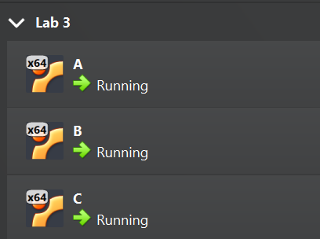
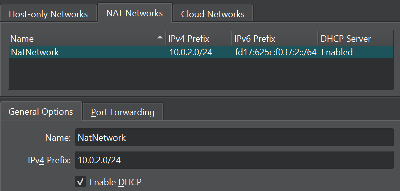
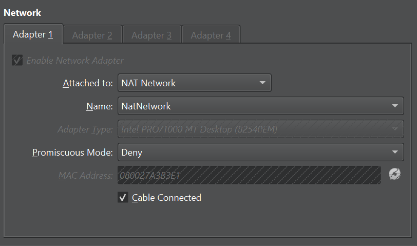
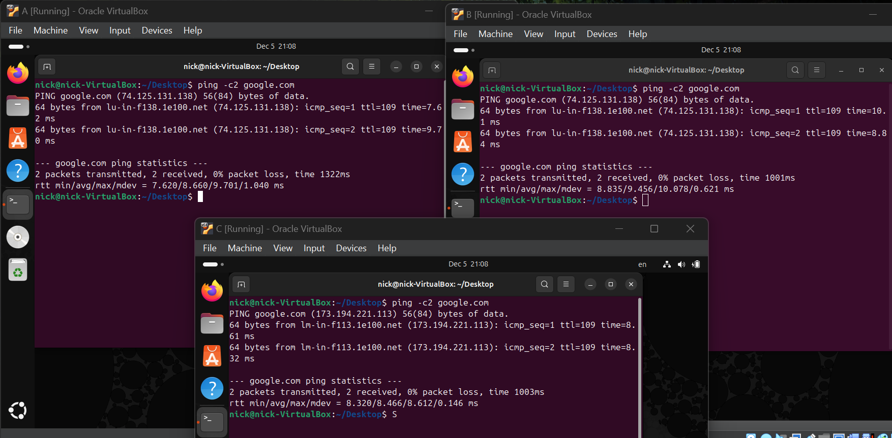
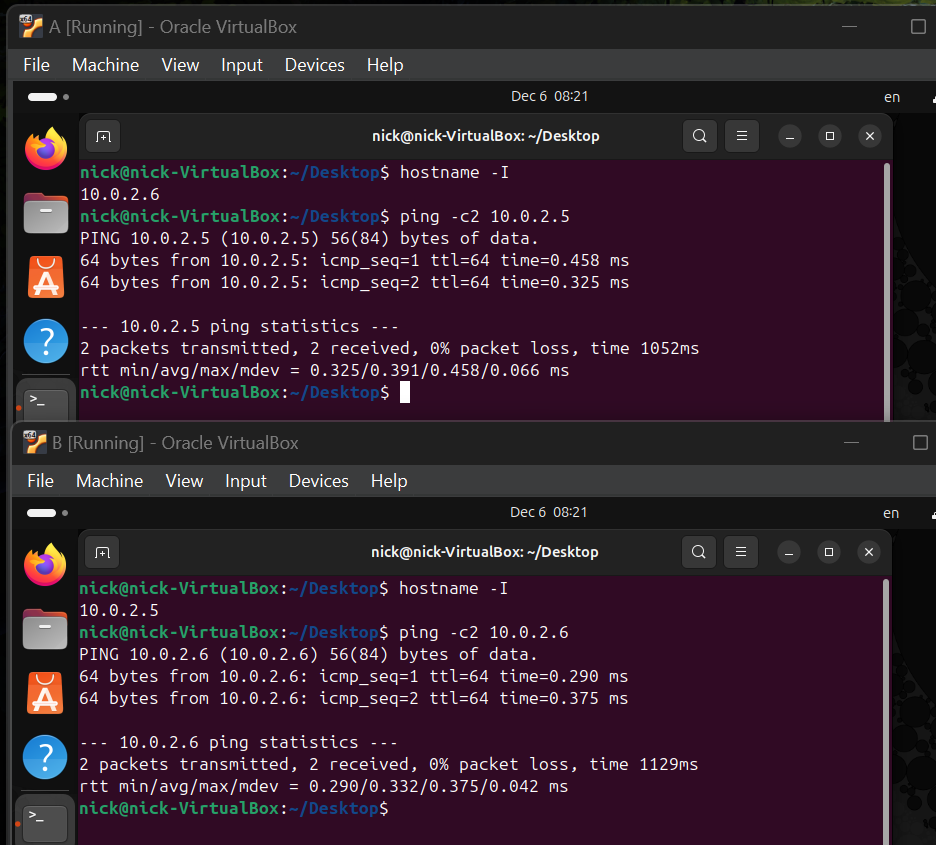
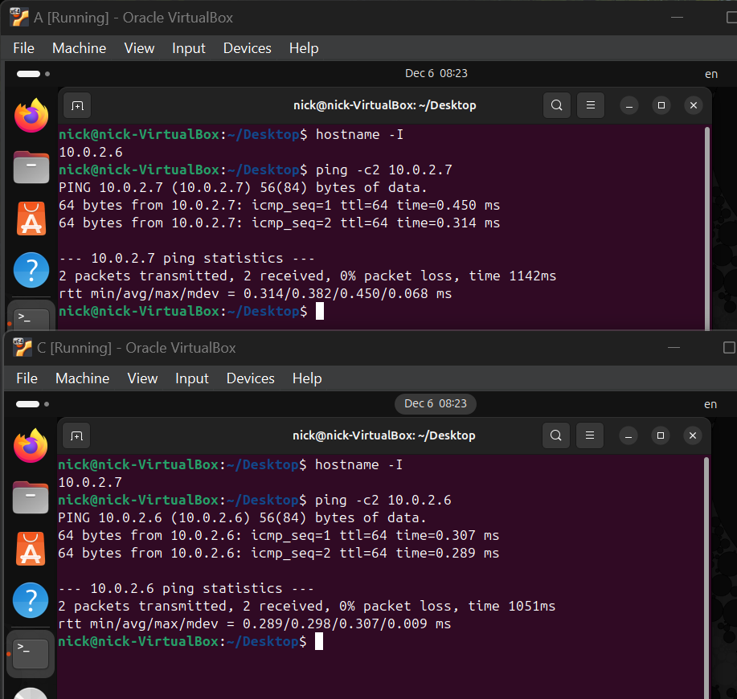
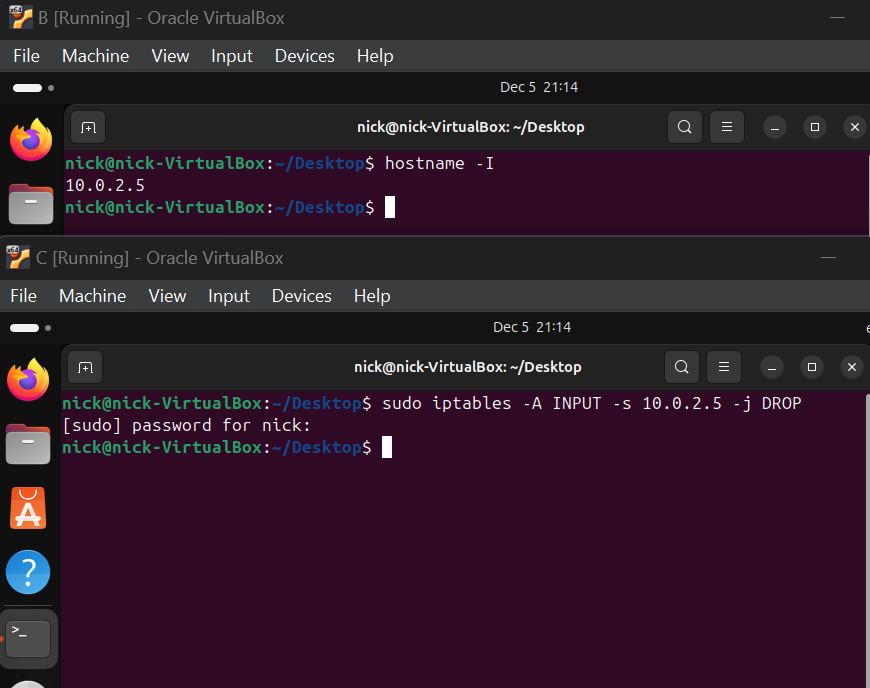
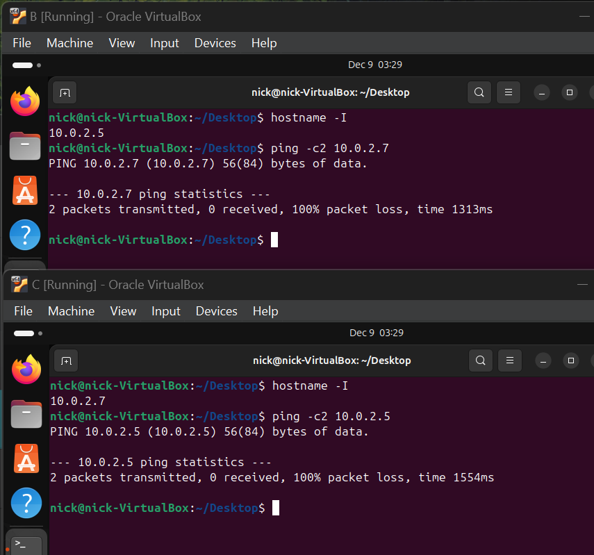

# Отчет по лабораторной работе 3
*Выполнил __Малыхин Никита Сергеевич__* 

## Цель
Необходимо настроить виртуальную машину А с Ubuntu (желательно, но можно и другую Linux подобную ОС) в VirtualBox. Обеспечить доступ в сеть Интернет. Осуществить проверку этого доступа и приложить скриншот из терминала. Следующим шагом настроить ещё одну виртуальную машину Б. После чего обеспечить сетевой доступ от машины А к машину Б. Приложить скриншот из терминала. Поднять ещё одну виртуальную машину В. Организовать сетевой доступ:

1. из машины А в машину Б,
2. из машины А в машину В,
3. но запретить доступ из машины Б в машину В,
4. приложить скриншот, на котором видно терминалы всех трёх машин и видно что между машинами есть (или нет) доступа.


## Решение 

### 1. Настраиваем 3 виртуальные машины


### 2. Создаем NAT Network сеть 


### 3. Подключаем каждую вирутальную машину к созданной сети


### 4. Проверяем доступ в интеренет у каждой машины


### 5. Доступ из машины A в машину Б


### 6. Доступ из машины A в машину В


### 7. Запрет на доступ из машины Б в машину В


Команда ```sudo iptables -A INPUT -s 10.0.2.15 -j DROP``` добавляет правило, что при получении данных от IP-адреса 10.0.2.5 нужно их отбросить


